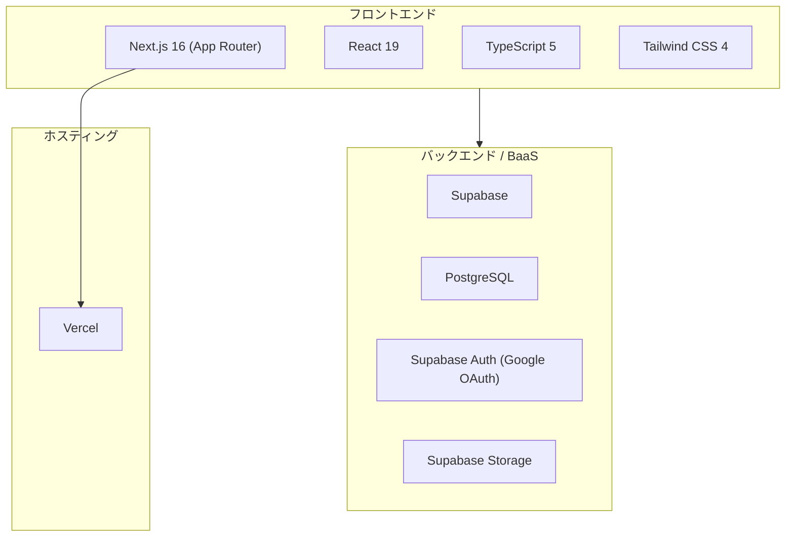
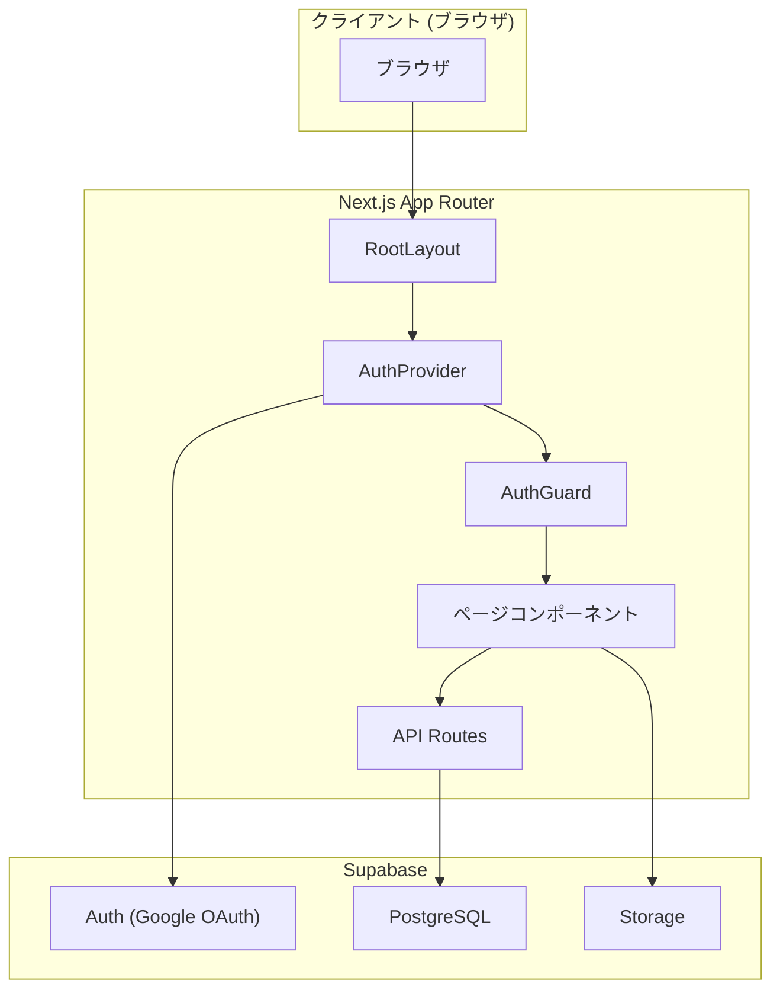
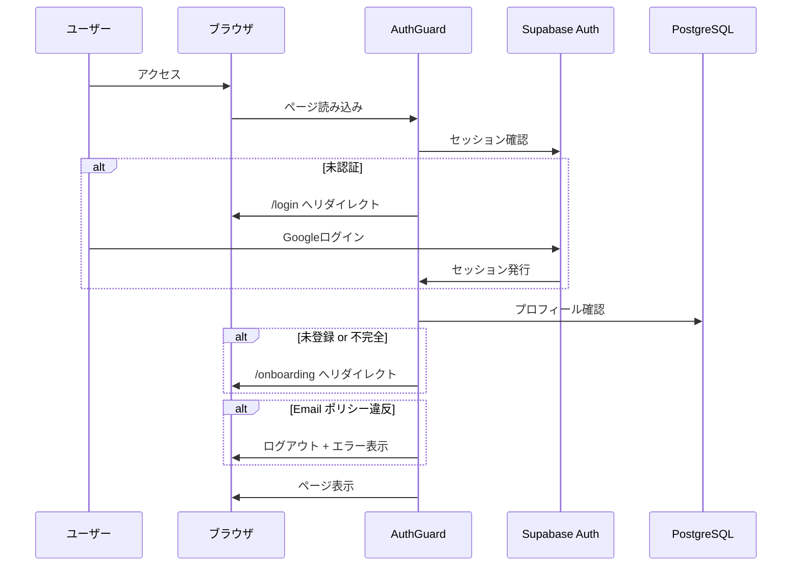
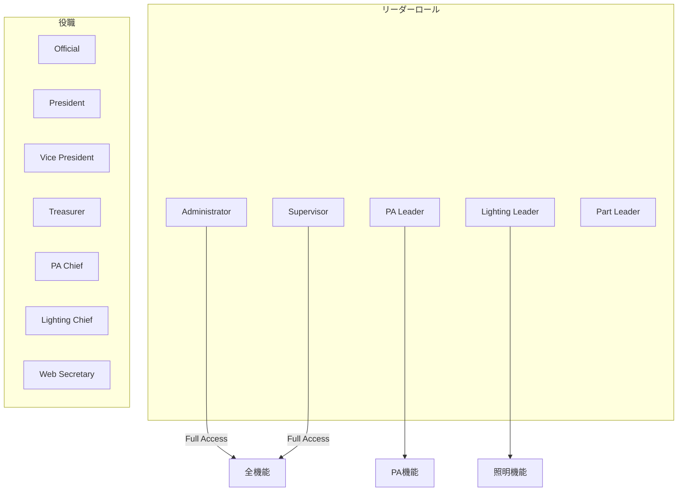
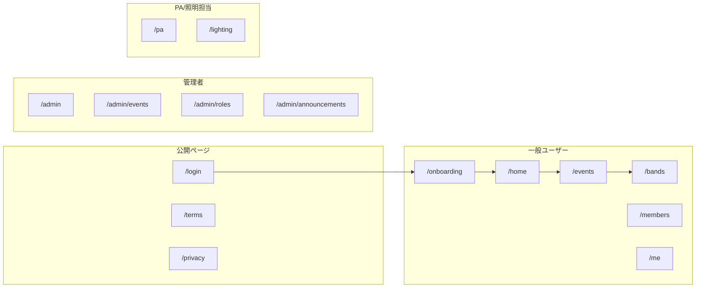
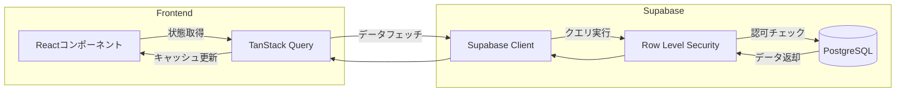
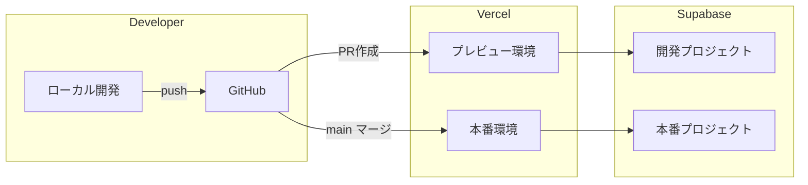

# Jacla Portal アーキテクチャ概要

> このドキュメントは、Jacla Portal のシステムアーキテクチャを説明するためのものです。

---

## 1. 技術スタック



| レイヤー | 技術 | バージョン |
|---------|------|-----------|
| **フレームワーク** | Next.js (App Router) | 16.0.7 |
| **UI ライブラリ** | React | 19.2.0 |
| **言語** | TypeScript | 5.x |
| **スタイリング** | Tailwind CSS | 4.x |
| **DB / BaaS** | Supabase (PostgreSQL) | 最新 |
| **認証** | Supabase Auth (Google OAuth) | - |
| **ホスティング** | Vercel | - |
| **状態管理** | TanStack Query | 5.90.16 |
| **UI コンポーネント** | Radix UI | 最新 |

---

## 2. ディレクトリ構造

```
jacla-portal/
├── app/                    # Next.js App Router ページ
│   ├── admin/              # 管理者向けページ
│   ├── api/                # API Routes
│   ├── auth/               # 認証関連
│   ├── bands/              # バンド管理
│   ├── events/             # イベント管理
│   ├── lighting/           # 照明指示書
│   ├── pa/                 # PA指示書
│   ├── me/                 # マイページ
│   ├── members/            # 部員一覧
│   ├── onboarding/         # 初回登録
│   ├── maintenance/        # 備品管理
│   └── ...
├── components/             # 共通UIコンポーネント
│   ├── ui/                 # 基本UIパーツ (Button, Card, Dialog等)
│   ├── instructions/       # PA/照明指示書コンポーネント
│   └── ...
├── lib/                    # ユーティリティ・フック
│   ├── supabaseClient.tsx  # Supabase クライアント
│   ├── AuthGuard.tsx       # 認証ガード
│   ├── useIsAdmin.ts       # 管理者判定フック
│   └── ...
├── contexts/               # React Context
│   └── AuthContext.tsx     # 認証コンテキスト
├── public/                 # 静的ファイル
├── tools/                  # 外部ツール (AI等)
└── 仕様書/                  # ドキュメント
```

---

## 3. アプリケーションアーキテクチャ



### 3.1 レイヤー構成

1. **プレゼンテーション層** (`app/`, `components/`)
   - Next.js App Router によるファイルベースルーティング
   - Server Components と Client Components の使い分け
   - Radix UI ベースの共通 UI コンポーネント

2. **ビジネスロジック層** (`lib/`)
   - 認証・認可ロジック (`AuthGuard.tsx`)
   - ロール判定フック (`useIsAdmin.ts`, `useRoleFlags.ts`)
   - ユーティリティ関数

3. **データアクセス層** (`lib/supabaseClient.tsx`, `app/api/`)
   - Supabase クライアントによる直接 DB アクセス
   - API Routes による外部連携

4. **状態管理層** (`contexts/`, TanStack Query)
   - 認証状態 (`AuthContext`)
   - サーバー状態キャッシュ (TanStack Query)

---

## 4. 認証・認可フロー



### 認証ポリシー

| 条件 | 対象ドメイン | 備考 |
|------|-------------|------|
| **許可** | `edu.teu.ac.jp` | 大学メールアドレス |
| **許可** | Gmail (管理者のみ) | Administrator/Supervisor ロール保持者 |
| **拒否** | その他 | ログイン不可 |

---

## 5. ロール・権限モデル



---

## 6. 主要ページマップ



---

## 7. データフロー



---

## 8. 主要コンポーネント関係

| コンポーネント | 役割 | ファイル |
|---------------|------|---------|
| `RootLayout` | アプリ全体のレイアウト | `app/layout.tsx` |
| `AuthProvider` | 認証状態の提供 | `contexts/AuthContext.tsx` |
| `AuthGuard` | 認証・認可チェック | `lib/AuthGuard.tsx` |
| `SideNav` | サイドナビゲーション | `components/SideNav.tsx` |
| `PageHeader` | ページヘッダー | `components/PageHeader.tsx` |
| `QueryProvider` | TanStack Query 設定 | `components/QueryProvider.tsx` |

---

## 9. デプロイメント構成



---

## 10. セキュリティ対策

| 対策 | 実装 |
|------|------|
| **認証** | Supabase Auth + Google OAuth |
| **認可** | AuthGuard + RLS (Row Level Security) |
| **ドメイン制限** | `edu.teu.ac.jp` のみ許可 |
| **データ保護** | 学籍番号は `profile_private` テーブルに分離 |
| **セッション管理** | Supabase セッション (JWT) |

---

## 参考リンク

- [Next.js Documentation](https://nextjs.org/docs)
- [Supabase Documentation](https://supabase.com/docs)
- [Tailwind CSS Documentation](https://tailwindcss.com/docs)
- [TanStack Query Documentation](https://tanstack.com/query/latest)
