# Jacla Portal マルチテナントSaaS DB設計書

更新日: 2026-05-04

## 1. 目的

本書は、Jacla Portal を単一団体向け構成から、複数団体で共通利用できるマルチテナントSaaSへ移行するための DB 設計書である。

今回の設計では、以下を同時に満たすことを目的とする。

- 同じユーザーが複数団体に所属できる
- 団体ごとに権限、役職、部署、楽器、機能を分けられる
- 団体管理者が管理画面から役職や楽器や機能設定を増減できる
- 共通基盤は 1 つに保ち、団体差分は設定とマスタで吸収する
- 将来的な機能追加時に、既存団体を壊さず拡張できる

---

## 2. 設計原則

### 2.1 スコープを 3 層に分ける

- `Platform`
  全団体共通の基盤設定、監査、モジュール定義、全体権限
- `Organization`
  団体ごとの設定、権限、役職、部署、楽器、機能有効化
- `User`
  個人そのもののプロフィールと認証情報

### 2.2 ユーザー本人と団体内属性を分離する

以下は分離して持つ。

- ユーザー本人
- 所属
- システム権限
- 部内役職
- 部署
- 楽器

### 2.3 団体差分はマスタ駆動で扱う

コードで分岐しない。差分は原則以下で吸収する。

- マスタテーブル
- 設定テーブル
- モジュール有効化テーブル
- カスタムフィールド定義

### 2.4 団体スコープのテーブルには `organization_id` を持たせる

外部キーを辿れば判定できるテーブルでも、RLS と検索性を優先して `organization_id` を直接持たせる。

例:

- `band_members`
- `songs`
- `slot_staff_assignments`
- `equipment_item_logs`

---

## 3. 命名・型方針

### 3.1 主キー

- 原則 `uuid`
- `id uuid primary key default gen_random_uuid()`

### 3.2 タイムスタンプ

原則として以下を持つ。

- `created_at timestamptz not null default now()`
- `updated_at timestamptz not null default now()`

必要に応じて以下を持つ。

- `archived_at timestamptz`
- `deleted_at timestamptz`

### 3.3 論理削除

役職、部署、楽器、モジュールは、基本的に物理削除ではなく論理停止で扱う。

推奨カラム:

- `is_active boolean not null default true`
- `archived_at timestamptz`

### 3.4 表示順

管理画面から並び順を変更できるようにするため、マスタ系テーブルには `sort_order integer not null default 100` を付与する。

### 3.5 スラッグ

管理画面や内部識別の安定化のため、表示名とは別に `slug text not null` を持たせる。

---

## 4. 論理ER概要

```mermaid
erDiagram
    PROFILES ||--o{ PROFILE_PRIVATE : has
    PROFILES ||--o{ PLATFORM_USER_ROLES : has
    PROFILES ||--o{ ORGANIZATION_MEMBERSHIPS : joins

    ORGANIZATIONS ||--o{ ORGANIZATION_SETTINGS : has
    ORGANIZATIONS ||--o{ ORGANIZATION_MEMBERSHIPS : has
    ORGANIZATIONS ||--o{ ORGANIZATION_ROLES : has
    ORGANIZATIONS ||--o{ ORGANIZATION_POSITIONS : has
    ORGANIZATIONS ||--o{ ORGANIZATION_DEPARTMENTS : has
    ORGANIZATIONS ||--o{ ORGANIZATION_INSTRUMENTS : has
    ORGANIZATIONS ||--o{ ORGANIZATION_MODULES : has
    ORGANIZATIONS ||--o{ ORGANIZATION_CUSTOM_FIELDS : has

    ORGANIZATION_ROLES ||--o{ ORGANIZATION_ROLE_PERMISSIONS : grants
    PLATFORM_PERMISSIONS ||--o{ ORGANIZATION_ROLE_PERMISSIONS : maps
    ORGANIZATION_MEMBERSHIPS ||--o{ ORGANIZATION_MEMBER_ROLES : gets
    ORGANIZATION_MEMBERSHIPS ||--o{ ORGANIZATION_MEMBER_POSITIONS : gets
    ORGANIZATION_MEMBERSHIPS ||--o{ ORGANIZATION_MEMBER_DEPARTMENTS : gets
    ORGANIZATION_MEMBERSHIPS ||--o{ ORGANIZATION_MEMBER_INSTRUMENTS : gets

    PLATFORM_MODULES ||--o{ ORGANIZATION_MODULES : enables

    ORGANIZATIONS ||--o{ EVENTS : owns
    ORGANIZATIONS ||--o{ BANDS : owns
    ORGANIZATIONS ||--o{ ANNOUNCEMENTS : owns
    ORGANIZATIONS ||--o{ EQUIPMENT_ITEMS : owns
```



---

## 5. 共通ユーザー領域

## 5.1 `profiles`

個人そのものの共通プロフィールを保持する。

| カラム | 型 | Null | 説明 |
|---|---|---:|---|
| `id` | `uuid` | No | Supabase Auth の user id と一致 |
| `display_name` | `text` | Yes | 表示名 |
| `real_name` | `text` | Yes | 氏名 |
| `avatar_url` | `text` | Yes | アイコン URL |
| `discord_id` | `text` | Yes | 外部連携用 ID |
| `email` | `text` | Yes | 参照用メールアドレス |
| `created_at` | `timestamptz` | No | 作成日時 |
| `updated_at` | `timestamptz` | No | 更新日時 |

注意:

- `leader`
- `crew`
- `part`
- `muted`

は持たせない。いずれも団体スコープに移す。

## 5.2 `profile_private`

機微情報の保管先。

| カラム | 型 | Null | 説明 |
|---|---|---:|---|
| `profile_id` | `uuid` | No | `profiles.id` |
| `student_id` | `text` | Yes | 学籍番号 |
| `enrollment_year` | `integer` | Yes | 入学年 |
| `birth_date` | `date` | Yes | 生年月日 |
| `phone_number` | `text` | Yes | 電話番号 |
| `gender` | `text` | Yes | 任意項目 |
| `created_at` | `timestamptz` | No | 作成日時 |
| `updated_at` | `timestamptz` | No | 更新日時 |

備考:

- 個人の機微情報は原則ここに閉じる
- 団体によって見える範囲を RLS で制御する

---

## 6. プラットフォーム管理領域

## 6.1 `platform_user_roles`

全団体をまたぐ最上位権限。

| カラム | 型 | Null | 説明 |
|---|---|---:|---|
| `id` | `uuid` | No | PK |
| `profile_id` | `uuid` | No | `profiles.id` |
| `role_key` | `text` | No | `administer`, `platform_support` |
| `created_at` | `timestamptz` | No | 作成日時 |

制約:

- `unique(profile_id, role_key)`

## 6.2 `platform_permissions`

プラットフォームが持つ原子的な権限定義。

| カラム | 型 | Null | 説明 |
|---|---|---:|---|
| `id` | `uuid` | No | PK |
| `permission_key` | `text` | No | 例 `events.manage` |
| `name` | `text` | No | 表示名 |
| `description` | `text` | Yes | 説明 |
| `module_key` | `text` | No | 所属モジュール |
| `is_system` | `boolean` | No | コード側で予約された権限か |
| `sort_order` | `integer` | No | 並び順 |
| `created_at` | `timestamptz` | No | 作成日時 |

注意:

- 権限の原子単位はプラットフォーム側で管理する
- 団体側は権限自体を作るのではなく、`役割` に権限を割り当てる

## 6.3 `platform_modules`

共通機能の一覧。

| カラム | 型 | Null | 説明 |
|---|---|---:|---|
| `id` | `uuid` | No | PK |
| `module_key` | `text` | No | 例 `events`, `bands`, `announcements` |
| `name` | `text` | No | 表示名 |
| `description` | `text` | Yes | 説明 |
| `route_base` | `text` | Yes | 例 `/events` |
| `is_system` | `boolean` | No | システム標準か |
| `sort_order` | `integer` | No | 並び順 |
| `created_at` | `timestamptz` | No | 作成日時 |

備考:

- `新機能そのもの` はコードで追加する
- `団体で使うかどうか` は後述の `organization_modules` で制御する

---

## 7. 団体コア領域

## 7.1 `organizations`

団体本体。

| カラム | 型 | Null | 説明 |
|---|---|---:|---|
| `id` | `uuid` | No | PK |
| `slug` | `text` | No | URL 用識別子 |
| `name` | `text` | No | 団体名 |
| `short_name` | `text` | Yes | 短縮名 |
| `status` | `text` | No | `active`, `inactive`, `archived` |
| `owner_profile_id` | `uuid` | Yes | 初期責任者 |
| `created_at` | `timestamptz` | No | 作成日時 |
| `updated_at` | `timestamptz` | No | 更新日時 |

制約:

- `unique(slug)`

## 7.2 `organization_settings`

団体別の表示・運用設定。

| カラム | 型 | Null | 説明 |
|---|---|---:|---|
| `organization_id` | `uuid` | No | `organizations.id` |
| `portal_title` | `text` | Yes | ポータル表示名 |
| `logo_url` | `text` | Yes | ロゴ |
| `theme_seed` | `text` | Yes | テーマ識別 |
| `allowed_email_domains` | `jsonb` | Yes | 許可ドメイン一覧 |
| `allow_personal_email` | `boolean` | No | 個人メール許可 |
| `is_open` | `boolean` | No | 団体ポータル開閉 |
| `settings_json` | `jsonb` | No | 細かな追加設定 |
| `updated_by` | `uuid` | Yes | 更新者 |
| `updated_at` | `timestamptz` | No | 更新日時 |

備考:

- 現在の `site_settings` はここへ吸収する
- 開閉設定も団体単位にする

## 7.3 `organization_memberships`

ユーザーの団体所属。

| カラム | 型 | Null | 説明 |
|---|---|---:|---|
| `id` | `uuid` | No | PK |
| `organization_id` | `uuid` | No | `organizations.id` |
| `profile_id` | `uuid` | No | `profiles.id` |
| `membership_status` | `text` | No | `active`, `invited`, `suspended`, `left` |
| `is_primary` | `boolean` | No | 主所属か |
| `is_muted` | `boolean` | No | 団体単位ミュート |
| `joined_at` | `timestamptz` | Yes | 参加日時 |
| `left_at` | `timestamptz` | Yes | 離脱日時 |
| `created_at` | `timestamptz` | No | 作成日時 |
| `updated_at` | `timestamptz` | No | 更新日時 |

制約:

- `unique(organization_id, profile_id)`
- 主所属はユーザー単位で 1 つまでにするかは別途運用判断

---

## 8. 団体内の権限・役職・部署・楽器

## 8.1 システム権限用ロール

### `organization_roles`

団体で使うシステムロール定義。

| カラム | 型 | Null | 説明 |
|---|---|---:|---|
| `id` | `uuid` | No | PK |
| `organization_id` | `uuid` | No | `organizations.id` |
| `slug` | `text` | No | 例 `org_sv`, `events_admin` |
| `name` | `text` | No | 表示名 |
| `description` | `text` | Yes | 説明 |
| `is_system` | `boolean` | No | システム保護ロールか |
| `is_active` | `boolean` | No | 有効か |
| `sort_order` | `integer` | No | 並び順 |
| `created_at` | `timestamptz` | No | 作成日時 |
| `updated_at` | `timestamptz` | No | 更新日時 |

制約:

- `unique(organization_id, slug)`

### `organization_role_permissions`

ロールに権限を紐付ける。

| カラム | 型 | Null | 説明 |
|---|---|---:|---|
| `id` | `uuid` | No | PK |
| `organization_role_id` | `uuid` | No | `organization_roles.id` |
| `platform_permission_id` | `uuid` | No | `platform_permissions.id` |
| `created_at` | `timestamptz` | No | 作成日時 |

制約:

- `unique(organization_role_id, platform_permission_id)`

### `organization_member_roles`

メンバーにロールを付与する。

| カラム | 型 | Null | 説明 |
|---|---|---:|---|
| `id` | `uuid` | No | PK |
| `organization_membership_id` | `uuid` | No | `organization_memberships.id` |
| `organization_role_id` | `uuid` | No | `organization_roles.id` |
| `created_at` | `timestamptz` | No | 作成日時 |

制約:

- `unique(organization_membership_id, organization_role_id)`

## 8.2 部内役職

### `organization_positions`

団体独自の肩書き。

| カラム | 型 | Null | 説明 |
|---|---|---:|---|
| `id` | `uuid` | No | PK |
| `organization_id` | `uuid` | No | `organizations.id` |
| `slug` | `text` | No | 内部識別子 |
| `name` | `text` | No | 表示名 |
| `description` | `text` | Yes | 説明 |
| `is_unique` | `boolean` | No | 団体内で 1 人だけか |
| `is_active` | `boolean` | No | 有効か |
| `sort_order` | `integer` | No | 並び順 |
| `created_at` | `timestamptz` | No | 作成日時 |
| `updated_at` | `timestamptz` | No | 更新日時 |

### `organization_member_positions`

メンバーへの役職付与。

| カラム | 型 | Null | 説明 |
|---|---|---:|---|
| `id` | `uuid` | No | PK |
| `organization_membership_id` | `uuid` | No | `organization_memberships.id` |
| `organization_position_id` | `uuid` | No | `organization_positions.id` |
| `started_at` | `timestamptz` | Yes | 開始日時 |
| `ended_at` | `timestamptz` | Yes | 終了日時 |
| `created_at` | `timestamptz` | No | 作成日時 |

## 8.3 部署・セクション

現在の `crew` は、権限ではなく部署概念として再設計する。

### `organization_departments`

| カラム | 型 | Null | 説明 |
|---|---|---:|---|
| `id` | `uuid` | No | PK |
| `organization_id` | `uuid` | No | `organizations.id` |
| `slug` | `text` | No | 例 `pa`, `lighting`, `band`, `web` |
| `name` | `text` | No | 表示名 |
| `description` | `text` | Yes | 説明 |
| `is_active` | `boolean` | No | 有効か |
| `sort_order` | `integer` | No | 並び順 |
| `created_at` | `timestamptz` | No | 作成日時 |
| `updated_at` | `timestamptz` | No | 更新日時 |

### `organization_member_departments`

| カラム | 型 | Null | 説明 |
|---|---|---:|---|
| `id` | `uuid` | No | PK |
| `organization_membership_id` | `uuid` | No | `organization_memberships.id` |
| `organization_department_id` | `uuid` | No | `organization_departments.id` |
| `is_primary` | `boolean` | No | 主部署か |
| `created_at` | `timestamptz` | No | 作成日時 |

## 8.4 楽器・パート

### `organization_instruments`

| カラム | 型 | Null | 説明 |
|---|---|---:|---|
| `id` | `uuid` | No | PK |
| `organization_id` | `uuid` | No | `organizations.id` |
| `slug` | `text` | No | 例 `gt`, `dr`, `asax` |
| `name` | `text` | No | 表示名 |
| `group_name` | `text` | Yes | 弦、木管、金管など |
| `description` | `text` | Yes | 説明 |
| `is_active` | `boolean` | No | 有効か |
| `sort_order` | `integer` | No | 並び順 |
| `created_at` | `timestamptz` | No | 作成日時 |
| `updated_at` | `timestamptz` | No | 更新日時 |

### `organization_member_instruments`

| カラム | 型 | Null | 説明 |
|---|---|---:|---|
| `id` | `uuid` | No | PK |
| `organization_membership_id` | `uuid` | No | `organization_memberships.id` |
| `organization_instrument_id` | `uuid` | No | `organization_instruments.id` |
| `is_primary` | `boolean` | No | 主担当か |
| `created_at` | `timestamptz` | No | 作成日時 |

---

## 9. 機能有効化・設定

## 9.1 `organization_modules`

団体ごとの機能 ON/OFF と名称変更。

| カラム | 型 | Null | 説明 |
|---|---|---:|---|
| `id` | `uuid` | No | PK |
| `organization_id` | `uuid` | No | `organizations.id` |
| `platform_module_id` | `uuid` | No | `platform_modules.id` |
| `is_enabled` | `boolean` | No | 有効か |
| `display_name` | `text` | Yes | 団体独自表示名 |
| `sort_order` | `integer` | No | ナビ並び順 |
| `created_at` | `timestamptz` | No | 作成日時 |
| `updated_at` | `timestamptz` | No | 更新日時 |

制約:

- `unique(organization_id, platform_module_id)`

## 9.2 `organization_module_settings`

モジュール単位の細かな設定。

| カラム | 型 | Null | 説明 |
|---|---|---:|---|
| `id` | `uuid` | No | PK |
| `organization_module_id` | `uuid` | No | `organization_modules.id` |
| `setting_key` | `text` | No | 設定キー |
| `setting_value` | `jsonb` | No | 設定値 |
| `created_at` | `timestamptz` | No | 作成日時 |
| `updated_at` | `timestamptz` | No | 更新日時 |

例:

- `events.default_changeover_min`
- `bands.require_stage_plot`
- `members.require_phone_number`

---

## 10. カスタムフィールド

## 10.1 `organization_custom_fields`

追加項目定義。

| カラム | 型 | Null | 説明 |
|---|---|---:|---|
| `id` | `uuid` | No | PK |
| `organization_id` | `uuid` | No | `organizations.id` |
| `target_type` | `text` | No | `profile`, `event`, `band`, `form_submission` など |
| `field_key` | `text` | No | 内部識別子 |
| `label` | `text` | No | 表示名 |
| `field_type` | `text` | No | `text`, `textarea`, `number`, `date`, `select`, `checkbox` |
| `is_required` | `boolean` | No | 必須か |
| `is_active` | `boolean` | No | 有効か |
| `sort_order` | `integer` | No | 並び順 |
| `validation_json` | `jsonb` | No | バリデーション設定 |
| `settings_json` | `jsonb` | No | 表示設定 |
| `created_at` | `timestamptz` | No | 作成日時 |
| `updated_at` | `timestamptz` | No | 更新日時 |

制約:

- `unique(organization_id, target_type, field_key)`

## 10.2 `organization_custom_field_options`

選択肢定義。

| カラム | 型 | Null | 説明 |
|---|---|---:|---|
| `id` | `uuid` | No | PK |
| `organization_custom_field_id` | `uuid` | No | 親フィールド |
| `option_key` | `text` | No | 内部値 |
| `label` | `text` | No | 表示名 |
| `sort_order` | `integer` | No | 並び順 |
| `is_active` | `boolean` | No | 有効か |

## 10.3 `custom_field_values`

汎用値テーブル。

| カラム | 型 | Null | 説明 |
|---|---|---:|---|
| `id` | `uuid` | No | PK |
| `organization_id` | `uuid` | No | `organizations.id` |
| `custom_field_id` | `uuid` | No | `organization_custom_fields.id` |
| `entity_type` | `text` | No | `profile`, `event`, `band` など |
| `entity_id` | `uuid` | No | 対象レコード id |
| `value_json` | `jsonb` | No | 値 |
| `created_at` | `timestamptz` | No | 作成日時 |
| `updated_at` | `timestamptz` | No | 更新日時 |

備考:

- 初期は汎用値テーブルで十分
- パフォーマンス要件が上がったら対象別に分割を検討する

---

## 11. 既存業務テーブルの移行方針

## 11.1 `events`

追加カラム:

- `organization_id uuid not null`

維持する主なカラム:

- `name`
- `date`
- `status`
- `event_type`
- `venue`
- `open_time`
- `start_time`
- `end_time`
- `note`

## 11.2 `bands`

追加カラム:

- `organization_id uuid not null`

備考:

- `event_id` を持つため組織は導出可能だが、RLS と索引のため直接持つ

## 11.3 `band_members`

追加カラム:

- `organization_id uuid not null`
- `organization_membership_id uuid not null`
- `organization_instrument_id uuid null`

備考:

- 既存の `user_id` だけでは団体スコープが弱い
- 楽器は団体マスタ参照に切り替える

## 11.4 `songs`

追加カラム:

- `organization_id uuid not null`

## 11.5 `announcements`

追加カラム:

- `organization_id uuid not null`

備考:

- カテゴリも将来的にはマスタ化可能
- 初期は `text` または団体設定で制御してよい

## 11.6 `equipment_items` / `equipment_instruments`

追加カラム:

- `organization_id uuid not null`

備考:

- `category` や `section` は将来的に団体別マスタへ寄せられる

## 11.7 `external_link_pages`

追加カラム:

- `organization_id uuid not null`

備考:

- 現在の単一行構成はやめ、団体別ページにする

## 11.8 `site_settings`

移行先:

- `organization_settings.is_open`

## 11.9 `profile_leaders`

移行先:

- `organization_roles`
- `organization_member_roles`

## 11.10 `profile_positions`

移行先:

- `organization_positions`
- `organization_member_positions`

## 11.11 `profile_parts`

移行先:

- `organization_instruments`
- `organization_member_instruments`

---

## 12. 管理画面で可能にする操作

## 12.1 Administer 画面

- 団体作成
- 団体停止/再開
- 標準モジュール管理
- 標準権限定義管理
- 標準テンプレート配布
- 全体監査ログ閲覧

## 12.2 Org SV 画面

- メンバー招待・停止
- ロール追加・編集・停止
- 役職追加・編集・停止
- 部署追加・編集・停止
- 楽器追加・編集・停止
- モジュール ON/OFF
- モジュール設定変更
- カスタムフィールド追加・編集・停止

重要:

- 削除は原則 `停止` または `archive`
- 参照中のマスタを物理削除しない

---

## 13. RLS 方針

## 13.1 基本ルール

1. 団体スコープのテーブルは `organization_id` で絞る
2. 画面権限ではなく DB 権限を正とする
3. 管理 API でもサーバー側で再判定する

## 13.2 補助関数

設けるべき関数:

- `is_administer(uid uuid)`
- `is_platform_support(uid uuid)`
- `is_org_member(uid uuid, org_id uuid)`
- `has_org_role(uid uuid, org_id uuid, role_slug text)`
- `has_org_permission(uid uuid, org_id uuid, permission_key text)`

## 13.3 代表的な読み取りポリシー

- 一般団体データ
  - `is_org_member(auth.uid(), organization_id)`
- 団体管理系
  - `has_org_permission(auth.uid(), organization_id, 'members.manage')`
- プラットフォーム管理系
  - `is_administer(auth.uid())`

---

## 14. インデックス方針

少なくとも以下にはインデックスを張る。

- `organization_memberships(organization_id, profile_id)`
- `organization_member_roles(organization_membership_id, organization_role_id)`
- `organization_member_positions(organization_membership_id, organization_position_id)`
- `organization_member_departments(organization_membership_id, organization_department_id)`
- `organization_member_instruments(organization_membership_id, organization_instrument_id)`
- `organization_modules(organization_id, platform_module_id)`
- `organization_custom_fields(organization_id, target_type, field_key)`
- 各業務テーブルの `(organization_id, created_at desc)`
- 各業務テーブルの `(organization_id, status)` またはよく使う絞り込み列

---

## 15. ストレージ設計方針

Storage は団体単位でパス分離する。

例:

```text
avatars/{profileId}/...
org/{organizationId}/announcements/...
org/{organizationId}/events/...
org/{organizationId}/forms/...
org/{organizationId}/bands/...
```

これにより、バケットを分けすぎずに RLS と運用を整理できる。

---

## 16. 初期マイグレーション順

### フェーズ 1

- `organizations`
- `organization_settings`
- `organization_memberships`
- `platform_user_roles`

を追加する。

### フェーズ 2

- `platform_modules`
- `platform_permissions`
- `organization_roles`
- `organization_role_permissions`
- `organization_member_roles`

を追加する。

### フェーズ 3

- `organization_positions`
- `organization_member_positions`
- `organization_departments`
- `organization_member_departments`
- `organization_instruments`
- `organization_member_instruments`

を追加する。

### フェーズ 4

既存ドメインテーブルへ `organization_id` を追加し、既存データを Jacla へ寄せる。

### フェーズ 5

RLS を `organization_id` ベースに再構築する。

### フェーズ 6

軽音部などの第 2 テナントを追加して、管理画面からマスタ設定を流し込む。

---

## 17. 現行スキーマからの代表変換

| 現行 | 新設計 |
|---|---|
| `profiles.leader` | `organization_member_roles` |
| `profile_leaders` | `organization_roles` + `organization_member_roles` |
| `profiles.crew` | `organization_departments` + `organization_member_departments` |
| `profiles.part` | `organization_instruments` + `organization_member_instruments` |
| `profiles.muted` | `organization_memberships.is_muted` |
| `profile_positions` | `organization_positions` + `organization_member_positions` |
| `site_settings` | `organization_settings` |
| `external_link_pages` 単一レコード | 団体別 `organization_id` 管理 |

---

## 18. 今回の DB 設計で得られる状態

この設計により、以下が管理画面から実現できる。

- 団体ごとに役職を追加・停止する
- 団体ごとに部署を追加・停止する
- 団体ごとに楽器を追加・停止する
- 団体ごとに機能を ON/OFF する
- 団体ごとに入力項目を増減する
- 同一ユーザーに対し、団体ごとに異なる立場を付与する

一方で、以下はコード追加が必要である。

- まったく新しい業務機能の追加
- 新しい画面ロジックの追加
- 権限の原子単位そのものの追加

---

## 19. まとめ

この DB 設計の中心は以下の 4 点である。

- ユーザー本人と団体内属性を分離する
- 団体差分をマスタ駆動に寄せる
- 団体スコープの全テーブルに `organization_id` を持たせる
- 物理削除より停止・アーカイブを基本にする

この方針で進めれば、Jacla の現行運用を残しつつ、3 か月後のマルチテナントSaaS初期運用へ現実的に移行できる。
